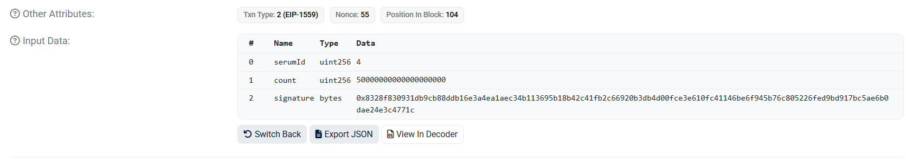
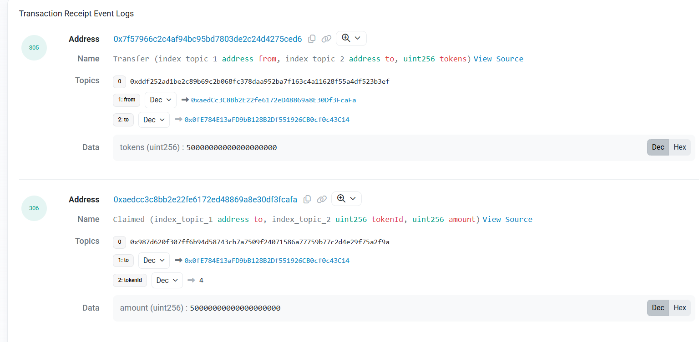

# Lab 05 — Ethereum accounts, gas & the EVM (read-only)

## Q1 / Câu hỏi 1
**Thêm mạng chỉ đổi endpoint RPC + chainId — khóa bí mật không rời thiết bị. Vì sao chainId cũng nằm trong mọi giao dịch được ký?**

`chainId` được đưa vào mọi giao dịch được ký để **chống tấn công phát lại (replay attack)** theo tiêu chuẩn EIP-155. Nếu không có `chainId`, một giao dịch bạn ký trên mạng TrustKeys L1 testnet có thể bị kẻ xấu copy và phát lại y hệt trên mạng Ethereum Mainnet (nơi bạn có thể đang dùng chung địa chỉ ví và private key), dẫn đến việc mất tiền ngoài ý muốn. `chainId` đảm bảo chữ ký chỉ có hiệu lực trên một mạng duy nhất.

## Q2 / Câu hỏi 2
**Base fee hiện chỉ vài wei, gasUsedRatio ~2%. Dùng quy tắc EIP-1559, giải thích vì sao base fee đứng ở đáy.**

Theo quy tắc EIP-1559, base fee sẽ tự động điều chỉnh tăng/giảm tối đa ±12.5% mỗi block dựa trên mức độ sử dụng gas của block trước đó so với mục tiêu (target là 15M gas). Vì mạng TrustKeys L1 hiện tại rất vắng, `gasUsedRatio` chỉ khoảng 2% (nghĩa là lượng gas sử dụng thấp hơn rất nhiều so với mức mục tiêu 15M). Do đó, giao thức liên tục áp dụng công thức giảm base fee xuống, cho đến khi nó chạm mức thấp nhất có thể (mức đáy).

## Q3 / Câu hỏi 3
**eth_feeHistory trả baseFeePerGas dài N+1 nhưng gasUsedRatio dài N. Phần tử dư là gì, và ví dùng nó để đặt maxFeePerGas thế nào?**

Phần tử dư ra thứ N+1 trong mảng `baseFeePerGas` chính là **phí cơ sở dự kiến (projected base fee) cho block tiếp theo** (block ngay sau khoảng thời gian bạn truy vấn).
Các ví điện tử (như MetaMask) sử dụng giá trị dự kiến này làm cơ sở để ước tính và thiết lập thông số `maxFeePerGas` an toàn cho giao dịch của bạn (thường công thức là `projected_base_fee * 2 + maxPriorityFee`), nhằm đảm bảo giao dịch của bạn chắc chắn được đưa vào block tiếp theo dù cho base fee có tăng đột ngột.

## Q4 / Câu hỏi 4
**Nếu bạn tăng max base fee trong MetaMask nhưng giữ nguyên priority fee, effectiveGasPrice có đổi không? Vì sao?**

**Trong phần lớn trường hợp là Không thay đổi.**
Dựa vào công thức: `effectiveGasPrice = baseFee + min(maxPriorityFee, maxFee - baseFee)`.
Nếu `maxFee` ban đầu đã đủ lớn để trang trải `baseFee + maxPriorityFee`, hàm `min()` sẽ luôn lấy giá trị `maxPriorityFee`. Việc bạn tăng `max base fee` lên chỉ là tăng mức "giới hạn tối đa bạn sẵn sàng trả", còn giá thực trả vẫn là `baseFee + maxPriorityFee` (không đổi).

**Ngoại lệ duy nhất (CÓ thay đổi):**
`effectiveGasPrice` sẽ chỉ tăng lên NẾU trước đó bạn cài `maxFee` quá thấp và lấn vào tiền Tip (tức là `maxFee - baseFee < maxPriorityFee`). Lúc này, phần tiền Tip thực tế trả cho Validator đang bị bóp nghẹt. Việc bạn tăng `maxFee` sẽ tạo không gian để giải phóng lượng tiền Tip đó bung ra cho đến mức tối đa bạn cài, kéo theo phí thực tế tăng lên.
## Q5 / Câu hỏi 5
**Một giao dịch chuyển đơn giản dùng đúng 21.000 gas. Con số đó từ đâu ra, và vì sao một giao dịch thất bại vẫn tốn gas?**

- Con số **21.000 gas** là *chi phí gas nội tại (intrinsic gas)* được giao thức Ethereum quy định cứng (hardcoded) cho mọi giao dịch tiêu chuẩn (như chuyển ETH/coin từ ví này sang ví khác).
- Một giao dịch **thất bại vẫn tốn phí gas** bởi vì các node/thợ đào trên mạng lưới vẫn phải tiêu tốn tài nguyên máy tính (CPU, RAM) để nhận giao dịch, xác minh chữ ký, và bắt đầu chạy các lệnh thực thi cho đến khi nó gặp lỗi (ví dụ: out of gas, hoặc revert). Phí gas chính là tiền công trả cho lượng tài nguyên máy tính đã bị tiêu thụ đó.

## Lab 5.4 - Screenshots

*(Bạn hãy thay thế 2 dòng dưới đây bằng ảnh chụp màn hình của bạn)*

**a) Decoded Input Data showing the selector + args:**


**b) The Logs tab:**


## Q6 / Câu hỏi 6
**Giải thích trong 2 câu EVM dùng 4 byte (selector) này để nhảy tới đúng hàm (dispatcher) thế nào, và vì sao Etherscan cần ABI của hợp đồng để giải mã phần còn lại.**

1. Trong cấu trúc bytecode của hợp đồng, có một đoạn mã điều hướng (dispatcher). Khi EVM nhận giao dịch, nó sẽ lấy 4 byte selector này đem so sánh với danh sách các selector có sẵn trong dispatcher, nếu khớp nó sẽ "nhảy" (jump) tới thực thi khối mã lệnh tương ứng của hàm đó.
2. Dữ liệu phần còn lại (tham số truyền vào) chỉ là một chuỗi byte thô (hex); Etherscan bắt buộc phải có ABI (đóng vai trò như bản vẽ sơ đồ của hợp đồng) để biết chính xác các tham số này thuộc kiểu dữ liệu gì (address, uint256...) và độ dài bao nhiêu thì mới dịch ngược lại thành thông tin con người đọc được.

---

## Bài về nhà (Homework)

### 1. So sánh base-fee series TrustKeys L1 vs Sepolia
Khi chạy script kiểm tra, chuỗi base fee trên TrustKeys L1 luôn duy trì ở mức đáy (vài wei) và không đổi, trong khi base fee trên mạng Sepolia cao hơn (thường tính bằng Gwei) và liên tục biến động qua từng block.
Nguyên nhân là do mức độ hoạt động và nghẽn mạng khác nhau: Sepolia là mạng testnet phổ biến với lượng lớn lập trình viên liên tục deploy contract và gửi giao dịch, làm cho các block thường xuyên bị đầy, kích hoạt cơ chế EIP-1559 tự động tăng base fee. Ngược lại, TrustKeys L1 hiện tại rất ít giao dịch (tỷ lệ sử dụng gas chỉ ~2%), nên giao thức liên tục đẩy base fee xuống mức thấp tối thiểu.

### 2. Giải thích tỷ lệ chi phí gas của lệnh ADD, SLOAD, SSTORE (evm.codes)
- Lệnh **ADD** tốn **3 gas** vì đây là phép toán số học cơ bản, CPU xử lý cực kỳ nhanh và tốn rất ít tài nguyên.
- Lệnh **SLOAD** tốn **2100 gas** (cold) vì nó yêu cầu đọc dữ liệu từ ổ cứng (đọc trạng thái state trie) rất tốn kém, nhưng sẽ giảm còn 100 gas (warm) nếu dữ liệu đó đã được cache lại do vừa được đọc trước đó trong cùng giao dịch.
- Lệnh **SSTORE (0->x)** tốn tới **20.000 gas** vì thao tác cấp phát không gian bộ nhớ mới trên blockchain để lưu trữ vĩnh viễn là thao tác tốn nhiều tài nguyên nhất, việc đặt phí cao nhằm ngăn chặn việc spam làm phình to dữ liệu (state bloat) của mạng lưới.

---

## Phụ lục: Kết quả chạy Script (Logs)

### Lab 5.2: fee_history.py
```text
Connected to TrustKeys L1 chainId=11968 head block=717616
baseFeePerGas = 8 wei

block      baseFee(wei)    gasUsedRatio
717597     8               0.28%
... [các block khác cũng baseFee=8, gasUsedRatio < 6%]
717616     8               0.17%

next block's projected baseFee = 8 wei
```
*Nhận xét:* Dữ liệu thực tế cho thấy base fee luôn chạm đáy ở mức 8 wei, vì gasUsedRatio rất thấp (xa mức 100% mục tiêu).

### Lab 5.3: decompose.py (Giao dịch Type-2)
```text
baseFee = 8 wei
effectiveGasPrice = 2000000000 wei

paid   = 103446000000000 wei
burned = 413784 wei (roi luu thong)
tip    = 103445999586216 wei (ve proposer)

invariant OK: paid == burned + tip => True
```
*Nhận xét:* ở testnet TrustKeys L1, `baseFee` cực kỳ bé (8 wei), trong khi MetaMask thường mặc định gán khoản tiền boa `priorityFee` (tip) ở mức khoảng 2 Gwei (2,000,000,000 wei). Do đó phần lớn số tiền phí (paid) lại rơi vào túi của người xác thực (proposer) dưới dạng tiền tip, còn phần bị đốt (burned) là không đáng kể. Trên mainnet lúc nghẽn mạng thì ngược lại, phần bị đốt sẽ chiếm đa số.
